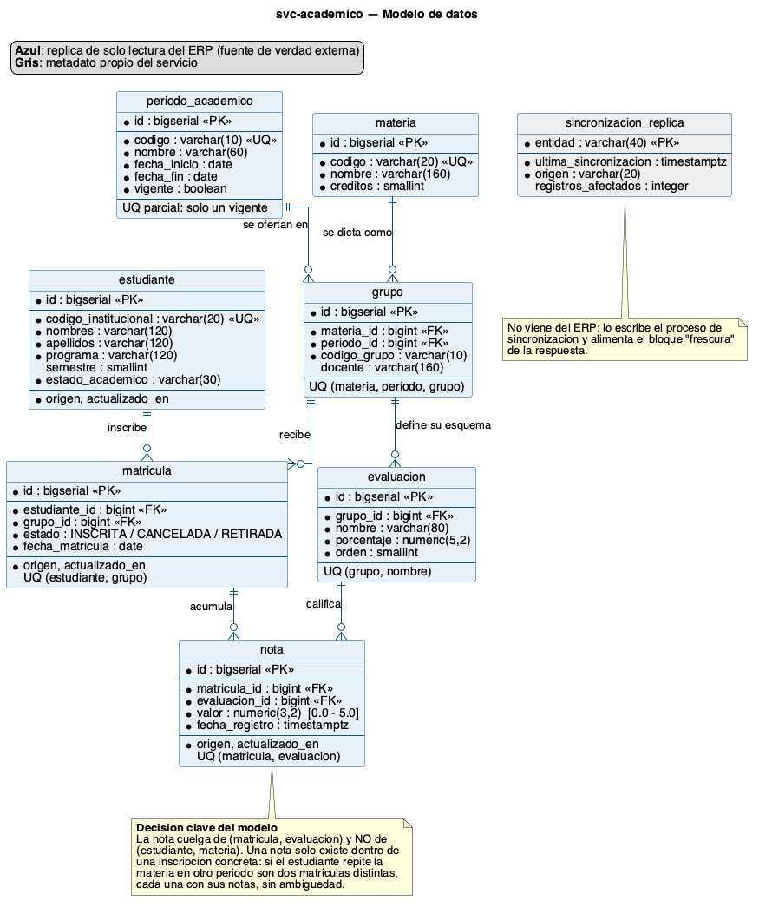

# svc-academico · Vista 360° del Estudiante

Servicio que, dado el identificador de un estudiante, devuelve **sus materias matriculadas y las notas
de las materias que tiene inscritas actualmente**.

Corresponde a la **Parte 2** de la prueba técnica. Es el servicio `svc-academico` del diseño de la
[Parte 1](../parte1-arquitectura/DECISIONES.md), no un ejercicio aislado: su comportamiento — en
particular que sirva una **réplica** y declare la frescura del dato — se deriva de las decisiones D2 y D5
tomadas allí.

| | |
|---|---|
| **Stack** | Java 21 · Spring Boot 4.1.1 · Spring Data JPA · PostgreSQL 17 · Flyway |
| **Pruebas** | JUnit 5 · MockMvc · Testcontainers 2 |
| **Documentación viva** | OpenAPI 3 en `/swagger-ui.html` · colección Postman en [`postman/`](postman/) |

---

## 1. Especificación del servicio

### Invocación

```
GET /api/v1/estudiantes/{codigoEstudiante}/carga-academica
```

El recurso se modela como **subrecurso del estudiante** y no como `/carga-academica?estudiante=`
porque la carga académica no existe sin un estudiante: la jerarquía de la URL refleja la del dominio
y deja abierto el camino a otros subrecursos (`/solicitudes`, `/alertas`) sin rediseñar el contrato.

### Qué recibe

| Parámetro | Ubicación | Obligatorio | Formato | Descripción |
|---|---|---|---|---|
| `codigoEstudiante` | ruta | sí | `A` + 8 dígitos (`A00398123`) | Código institucional del estudiante |
| `periodo` | query | no | `AAAA-NN` (`2026-01`) | Periodo a consultar. **Si se omite, se usa el vigente** |

Se usa el **código institucional** y no la clave primaria interna: es el identificador que el resto del
ecosistema ya entiende, y mantener la PK fuera del contrato permite cambiar el almacenamiento sin
romper a los consumidores.

### Qué devuelve

`200 OK` · `application/json`

```json
{
  "estudiante": {
    "codigo": "A00398123",
    "nombreCompleto": "Andres Felipe Lopez Reyes",
    "programa": "Ingenieria de Sistemas",
    "semestre": 7,
    "estadoAcademico": "ACTIVO"
  },
  "periodo": {
    "codigo": "2026-01",
    "nombre": "Primer semestre 2026",
    "fechaInicio": "2026-01-19",
    "fechaFin": "2026-05-23",
    "vigente": true
  },
  "materias": [
    {
      "codigo": "TIC-3011",
      "nombre": "Computacion en Internet II",
      "creditos": 3,
      "grupo": "01",
      "docente": "Carlos Andres Delgado",
      "notas": [
        { "evaluacion": "Parcial 1", "porcentaje": 30.0, "valor": 4.3, "fechaRegistro": "2026-03-06T20:20:00Z" },
        { "evaluacion": "Talleres",  "porcentaje": 15.0, "valor": 4.6, "fechaRegistro": "2026-03-20T14:05:00Z" }
      ],
      "notaAcumulada": 4.4,
      "porcentajeEvaluado": 45.0
    }
  ],
  "resumen": { "totalMaterias": 3, "totalCreditos": 9, "promedioAcumulado": 3.73 },
  "frescura": { "origen": "ERP", "sincronizadoEn": "2026-08-31T00:54:11Z", "antiguedadSegundos": 247 }
}
```

Tres elementos del contrato merecen justificación:

- **`notaAcumulada` se pondera contra lo evaluado, no contra 100.** En el ejemplo: `(4.3×30 + 4.6×15) / 45 = 4.40`.
  Sumar en crudo daría `1.98` y haría parecer que el estudiante va perdiendo cuando lo único que ocurre
  es que faltan evaluaciones por calificar. Es `null` si la materia aún no tiene ninguna nota.
- **`porcentajeEvaluado` acompaña siempre a la nota.** Un 4.40 sobre el 45% del curso no significa lo mismo
  que un 4.40 sobre el 95%, y el consumidor no debería tener que deducirlo.
- **`frescura` es parte del contrato, no un extra.** El servicio sirve una copia del ERP; quien la consume
  tiene derecho a saber de cuándo es para decidir si le basta o necesita ir a la fuente.

### Errores

Formato **RFC 9457** (`application/problem+json`), que Spring soporta de forma nativa. Se prefiere sobre un
formato propio para que cualquier consumidor del ecosistema interprete los errores sin acuerdos particulares.

| Código | Cuándo | `recurso` |
|---|---|---|
| `400` | El código del estudiante o el periodo no cumplen el formato | — |
| `404` | El estudiante no existe en la réplica | `estudiante` |
| `404` | El periodo solicitado no existe | `periodo` |
| `500` | Error no controlado. Al cliente solo le llega un mensaje genérico; la traza queda en el log | — |

**Un estudiante que existe pero no matriculó devuelve `200` con `materias: []`, nunca `404`.**
Existir y no tener carga son cosas distintas: confundirlas obligaría al consumidor a interpretar un
404 ambiguo.

---

## 2. Modelo de datos



DDL completo en [`V1__esquema_inicial.sql`](src/main/resources/db/migration/V1__esquema_inicial.sql).

### Decisiones de modelado

**La nota cuelga de `(matricula, evaluacion)`, no de `(estudiante, materia)`.**
Una nota solo existe dentro de una inscripción concreta. Si el estudiante repite la materia en otro
periodo son dos matrículas distintas, cada una con sus notas, y el modelo no queda ambiguo.

**`materia` y `grupo` están separados.** `materia` es el catálogo, estable entre periodos; `grupo` es la
oferta concreta de esa materia en un periodo, con su docente. Fusionarlos obligaría a duplicar la materia
cada semestre.

**El esquema de evaluación vive en el grupo.** Cada docente define sus porcentajes, así que ponerlo en la
materia sería incorrecto.

**Todo lo replicado lleva `origen` y `actualizado_en`.** Materializa la decisión D5 de la Parte 1: el
servicio debe poder responder no solo *cuál* es el dato sino *qué tan fresco* es.

**Invariantes en la base, no en el código.** Un índice único parcial garantiza que solo haya un periodo
vigente; `CHECK` acota las notas al rango 0.0–5.0 y los estados de matrícula al enum; el índice
`(estudiante_id, estado)` es exactamente el acceso que hace el servicio.

**Las entidades JPA están anotadas `@Immutable`.** El servicio es de solo lectura por diseño; la anotación
lo hace explícito y hace que un intento de escritura sea un error de compilación conceptual, no una
convención confiada a la disciplina.

---

## 3. Cómo ejecutarlo

**Requisitos:** JDK 21, Maven 3.9+, Docker.

```bash
docker compose up -d
./mvnw spring-boot:run
```

> Si el puerto 5432 ya está ocupado por un PostgreSQL local, exporta la variable **antes de ambos
> comandos**, en la misma terminal:
>
> ```bash
> export DB_PORT=5433
> ```
>
> `DB_PORT` gobierna a la vez el puerto que publica el contenedor y el que usa la aplicación. Si solo se
> pasara al `docker compose`, la aplicación apuntaría a la base local en lugar de al contenedor.

El esquema y los datos de ejemplo los aplica **Flyway al arrancar**, no el `docker-compose`: así el mismo
camino de migración se ejecuta en local y en despliegue.

| Recurso | URL |
|---|---|
| Servicio | http://localhost:8081/api/v1/estudiantes/A00398123/carga-academica |
| Swagger UI | http://localhost:8081/swagger-ui.html |
| Health | http://localhost:8081/actuator/health |

### Datos de ejemplo

Están diseñados para ejercitar los límites del contrato, no solo el camino feliz:

| Código | Caso que cubre |
|---|---|
| `A00398123` | Caso principal: 3 materias vigentes, una **cancelada** que no debe aparecer y una de un **periodo anterior** que no debe mezclarse |
| `A00401556` | Carga vigente con notas en dos materias |
| `A00377012` | Materia **sin ninguna nota**: acumulada nula y 0% evaluado |
| `A00412998` | Estudiante **sin matrículas**: `200` con lista vacía |
| `A00999999` | No existe: `404` |

---

## 4. Cómo probarlo

```bash
./mvnw verify
```

| Suite | Qué valida | Necesita Docker |
|---|---|---|
| `CargaAcademicaControllerTest` (4) | Contrato HTTP: códigos de estado, forma del JSON y validación de entrada, con el servicio simulado | No |
| `CargaAcademicaIT` (8) | Comportamiento real contra PostgreSQL levantado con Testcontainers | Sí |

Las pruebas de integración usan **PostgreSQL real y no una base en memoria** a propósito: lo que interesa
validar aquí es justamente lo que una base embebida no reproduce — las migraciones de Flyway, los índices
únicos parciales y el comportamiento del motor sobre el que el servicio va a correr de verdad.

Maven las separa con Failsafe: las unitarias corren en cada compilación, las de integración en `verify`.

También hay una **colección de Postman** en [`postman/`](postman/) con las 7 peticiones y sus aserciones,
ejecutable desde la aplicación o con `newman run`.

---

## 5. Lo que no está implementado y cómo lo abordaría

El alcance se acotó deliberadamente: **un endpoint terminado de punta a punta** en lugar de tres a medias.
Lo que falta para que este servicio sea el de la Parte 1, en orden de prioridad:

### 5.1 Refresco de la réplica por eventos
Hoy los datos se cargan con Flyway. En la arquitectura real, `svc-academico` se **suscribe al bus** de la
plataforma de integración y consume `MatriculaActualizada`, `NotaPublicada` y `EstadoAcademicoCambiado`.

Cómo lo haría: un consumidor por tipo de evento; **idempotencia** por identificador de evento (una tabla
`evento_procesado` con la PK del evento, para que un reintento del bus no duplique nada); actualización de
`actualizado_en` y de `sincronizacion_replica` en la misma transacción que el dato; y una **reconciliación
nocturna** contra el ERP que corrija las divergencias que el flujo de eventos haya dejado. Sin ese
reconciliador, cualquier evento perdido queda como un error silencioso permanente.

### 5.2 Autenticación y autorización
Descrito en la Parte 3. En código: `spring-boot-starter-oauth2-resource-server` validando el JWT de la
plataforma de identidad contra su JWKS, más una comprobación en el servicio de que el `sub` del token
corresponde al estudiante consultado, o de que el usuario de acompañamiento lo tiene asignado.

La regla **no puede vivir solo en el controlador**: iría en la capa de servicio, porque es una regla de
negocio y no una de transporte.

### 5.3 Resiliencia hacia el ERP
Cuando `svc-academico` consulte el ERP como respaldo, esa llamada necesita **timeout, reintento con
backoff y circuit breaker** (Resilience4j). Sin circuit breaker, un ERP lento se propaga como agotamiento
del pool de hilos y tumba el servicio entero.

### 5.4 Observabilidad
Actuator ya expone `health` y `prometheus`. Falta **trazabilidad distribuida** con Micrometer Tracing para
poder seguir una petición desde el navegador hasta el ERP, que es exactamente lo que el escenario A de la
Parte 4 requiere para diagnosticar un fallo intermitente.

### 5.5 Auditoría de accesos
El escenario B de la Parte 4 exige poder responder con certeza quién consultó qué. Requiere un registro
**append-only** de cada consulta — quién, a qué estudiante, cuándo, desde dónde — separado de los logs de
aplicación y con retención definida.

---

## 6. Uso de herramientas de IA

Declaración completa en [`USO-DE-IA.md`](../USO-DE-IA.md).

En esta parte definí el criterio del stack, el motor de base de datos y el alcance; **Claude (Claude Code)**
verificó las versiones vigentes contra Maven Central, escribió el código, resolvió las incompatibilidades
de Spring Boot 4 que fueron apareciendo y ejecutó las pruebas hasta dejarlas en verde.
