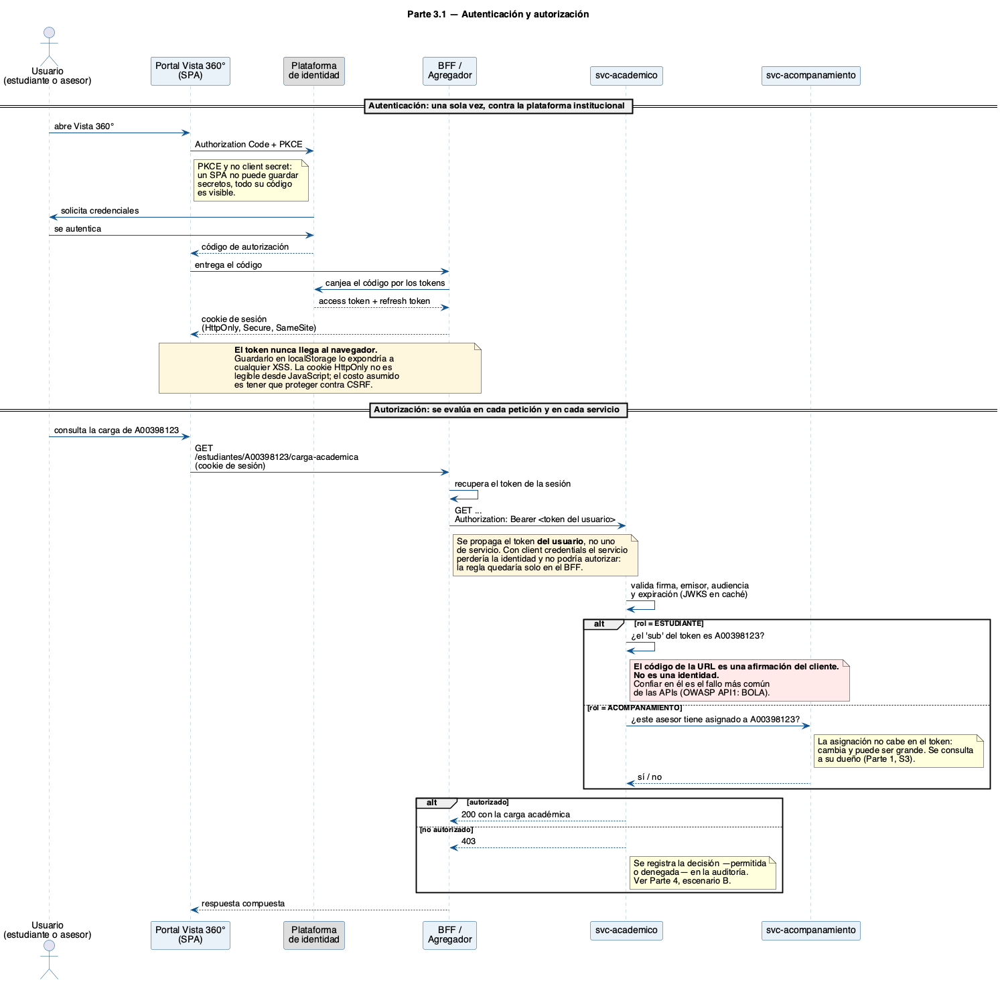
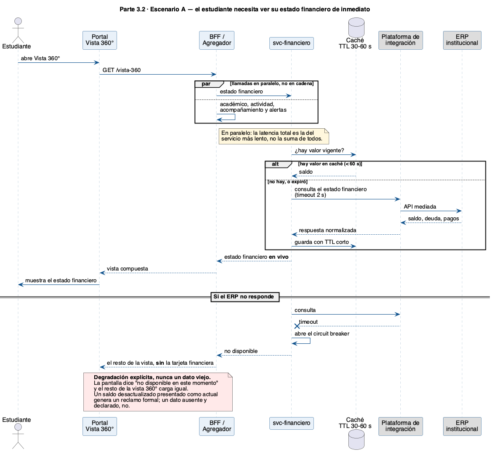

# Partes 3 y 4 · Seguridad, comunicación, operación y calidad

Respuestas argumentadas a cada escenario, con las decisiones y supuestos declarados.
Se apoyan en el diseño de la [Parte 1](../parte1-arquitectura/DECISIONES.md); cuando una respuesta
ya estaba resuelta allí, se indica en lugar de repetirla.

---

# Parte 3 · Seguridad y comunicación

## 3.1 · Autenticación y autorización



### Supuestos declarados

| # | Supuesto | Si fuera falso |
|---|---|---|
| A1 | La plataforma de identidad soporta OIDC y emite JWT firmados asimétricamente (RS256/ES256) con JWKS público | Habría que introducir un emisor propio, o validar por introspección con una llamada de red por petición |
| A2 | Estudiantes y personal viven en el **mismo** proveedor de identidad, diferenciados por rol o grupo | Se necesitaría federación entre dos emisores y una identidad unificada aguas abajo |
| A3 | La asignación asesor ↔ estudiante la administra Vista 360° (supuesto S3 de la Parte 1) | Si viniera del ERP, se replicaría, pero la regla de autorización no cambia |

### La distinción que ordena todo el diseño

Son dos preguntas distintas y se resuelven en lugares distintos:

| Pregunta | Qué la responde | Dónde vive |
|---|---|---|
| **¿Quién eres?** | Autenticación | Plataforma de identidad. Vista 360° no guarda ni valida credenciales |
| **¿Qué puedes hacer?** | Rol (RBAC) | Un *claim* del token: `ESTUDIANTE` o `ACOMPANAMIENTO` |
| **¿Sobre quién puedes hacerlo?** | Relación / alcance | `svc-acompanamiento`, dueño de la asignación |

El tercer punto es el que suele resolverse mal. **El alcance no puede vivir en el token**: la lista de
estudiantes asignados a un asesor cambia durante la vida del token y puede tener cientos de elementos.
Meterla como *claim* produciría tokens enormes y permisos obsoletos que siguen siendo válidos.

### Autenticación

**El SPA usa Authorization Code + PKCE, sin *client secret*.** Un SPA no puede guardar secretos: todo su
código es visible. PKCE sustituye al secreto con una prueba de posesión generada por sesión.

**El token nunca llega al navegador.** El BFF canjea el código, guarda los tokens del lado del servidor y
devuelve una **cookie de sesión `HttpOnly`, `Secure`, `SameSite`**.

- *Por qué:* guardar el JWT en `localStorage` lo deja expuesto a cualquier XSS — una sola dependencia de
  frontend comprometida basta para exfiltrarlo. Una cookie `HttpOnly` no es legible desde JavaScript.
- *Costo asumido:* hay que protegerse de CSRF. Se cubre con `SameSite=Strict` más un *token* anti-CSRF en
  las operaciones de escritura.
- *Alternativa descartada:* token en memoria del SPA con refresco silencioso. Es aceptable y más simple,
  pero deja el token al alcance del código de la página; con un BFF ya en la arquitectura, no hay razón.

**Los tokens son de vida corta (5–15 min) con refresco rotativo.** Un JWT no se puede revocar: la mitigación
es que caduque pronto. Para casos graves (una cuenta comprometida) se complementa con una lista de
revocación consultada solo en los servicios que tocan datos sensibles.

**Entre servicios**, la regla depende de si hay un usuario detrás:

| Tráfico | Mecanismo | Por qué |
|---|---|---|
| Petición originada por un usuario | Se **propaga el token del usuario** (o *token exchange*, RFC 8693) | Si se usara *client credentials*, el servicio perdería la identidad y no podría autorizar: la regla quedaría solo en el BFF |
| Procesos sin usuario: sincronizaciones, consumidores de eventos | OAuth2 *client credentials*, un `client_id` por servicio | No hay usuario que representar, y una credencial por servicio permite revocar solo la que se comprometa |

Sobre esto va **mTLS** entre servicios, para que la identidad de la carga de trabajo no dependa únicamente
de un *bearer token* que, si se filtra, cualquiera puede reutilizar.

### Autorización

**Regla 1 — El estudiante solo ve lo suyo.** Se compara el `sub` del token contra el estudiante solicitado.
No hay consulta a base de datos.

**Regla 2 — El asesor solo ve a sus asignados.** El servicio consulta a `svc-acompanamiento`. La respuesta
se cachea por poco tiempo: una asignación revocada no debe seguir concediendo acceso durante horas.

**Nunca se confía en el identificador de la URL.** En `GET /estudiantes/{codigo}/carga-academica`, el
`codigo` es una **afirmación del cliente**, no una identidad. Cualquiera puede cambiarlo por el de otro
estudiante. La identidad viene del token y solo del token. Es el fallo número uno del OWASP API Security
Top 10 (*Broken Object Level Authorization*) y el más fácil de cometer.

**La regla se evalúa en cada servicio, no solo en el borde.** Si la única barrera está en el *gateway* o en
el BFF, cualquier acceso que no pase por ahí —otro servicio comprometido, un *job* mal configurado, una
prueba apuntada a producción— se salta la autorización por completo. Defensa en profundidad: el borde
filtra el grueso, pero cada servicio vuelve a decidir sobre lo que le pertenece.

**Se niega por defecto.** Un recurso sin regla explícita responde 403. Un fallo de configuración debe
cerrar el acceso, no abrirlo.

**Cada decisión se registra** —permitida y denegada, con su razón— en el registro de auditoría. Es lo que
hace posible responder el escenario B de la Parte 4.

### Otros controles que asumo dados

TLS extremo a extremo · secretos en un gestor y nunca en el repositorio (de ahí el `.gitignore` del
proyecto) · limitación de tasa en el *gateway* · CORS restringido al dominio del portal · cabeceras de
seguridad y CSP en el SPA · datos sensibles cifrados en reposo.

### Lo que reconozco como discutible

Propagar el token del usuario hacia los servicios internos aumenta la superficie: si un servicio se
compromete, tiene un token de usuario válido en las manos. La alternativa —*token exchange* con reducción
de alcance en cada salto— es más segura pero añade una llamada al proveedor de identidad por petición.
Para el volumen de esta plataforma elegiría propagación directa con tokens de vida corta, y reservaría el
intercambio para los servicios que manejan lo financiero.

---

## 3.2 · Escenario A — el estudiante necesita ver su estado financiero de inmediato



### Decisión

**Consulta síncrona en vivo al ERP**, mediada por la plataforma de integración, con caché de 30–60 segundos
y *circuit breaker*. **El dato no se persiste en Vista 360°.**

Es la decisión D2 de la Parte 1, aplicada a este escenario concreto.

### Cómo se obtiene el dato desde su sistema de origen

```
Portal → BFF → svc-financiero → plataforma de integración → ERP
```

El BFF llama a los cinco servicios **en paralelo**, no en cadena: la latencia de la pantalla es la del
servicio más lento, no la suma de todos.

Ningún servicio toca el ERP directamente (decisión D3): la plataforma de integración normaliza el contrato,
aplica limitación de tasa y deja trazado cada acceso al sistema más crítico de la Universidad.

### Fundamentación

**Por qué síncrono y no una réplica.** El criterio no es técnico sino de consecuencia: *¿qué pasa si el dato
está desactualizado?* Un saldo obsoleto le dice a un estudiante que debe dinero que ya pagó — y eso produce
un reclamo formal, no una molestia. Una nota con dos minutos de desfase, no. El estado financiero además
cambia por eventos que ocurren **fuera** de Vista 360° (un pago en un banco), así que una réplica tendría
que garantizar consistencia sobre hechos que no controla.

**Por qué la caché es tan corta.** 30–60 segundos absorben el refresco de pantalla y las ráfagas de inicio
de semestre sin que el dato envejezca de forma perceptible. Si el ERP emite un evento `PagoRegistrado`, la
entrada se invalida de inmediato y el desfase desaparece.

**Qué pasa si el ERP no responde.** *Timeout* de 2 segundos y *circuit breaker*. La tarjeta financiera se
degrada con un mensaje explícito —"no disponible en este momento"— y **el resto de la vista 360° carga
igual**. Nunca se muestra un valor viejo presentado como actual: un dato ausente y declarado es honesto;
uno desactualizado disfrazado de vigente, no.

Sin *circuit breaker*, un ERP lento no produce una tarjeta lenta: agota el pool de hilos de
`svc-financiero` y tumba el servicio completo. Es la diferencia entre una degradación y una caída.

### Alternativa descartada

Precalcular el saldo en una réplica refrescada de noche. Es lo más rápido y lo más resiliente, pero un
estudiante que pagó ayer vería deuda hoy. El costo de la respuesta incorrecta supera al beneficio.

### Trade-off declarado

Este camino acopla la disponibilidad de esa tarjeta a la del ERP. Se acepta conscientemente: la alternativa
es mostrar un dato incorrecto, que es peor que no mostrarlo.

---

## 3.2 · Escenario B — cambia la condición académica de un estudiante

Ya resuelto en la Parte 1: ver el [diagrama de eventos y data warehouse](../parte1-arquitectura/diagramas/out/03-eventos-dw.png).

### Decisión

**Comunicación asíncrona dirigida por eventos**, publicada una sola vez en el bus de la plataforma de
integración y consumida de forma independiente por cada interesado.

```
ERP → (CDC o sondeo) → plataforma de integración → publica EstadoAcademicoCambiado
                                                        ├→ svc-academico  (refresca su réplica)
                                                        ├→ svc-alertas    (evalúa reglas y genera la alerta)
                                                        └→ data warehouse (ingesta analítica)
```

Como el ERP no emite eventos por sí solo (supuesto S2 de la Parte 1), es la plataforma de integración la
que deriva el cambio por captura de cambios sobre la base o por sondeo programado, y lo normaliza como un
evento de dominio.

### Fundamentación

**Por qué asíncrono.** Un cambio de condición académica le interesa a varios procesos a la vez, y esa lista
va a crecer. Resolverlo de forma síncrona obligaría a quien detecta el cambio a **conocer a todos los
interesados y esperarlos**: un consumidor caído bloquearía la propagación, y agregar un cuarto interesado
exigiría modificar al publicador. Con publicación y suscripción, quien publica no sabe quién escucha.

**Por qué no que cada proceso consulte al ERP periódicamente.** Multiplica la carga sobre el sistema más
frágil del ecosistema y hace que el retraso de la intervención temprana dependa de la frecuencia del sondeo.

**Por qué el data warehouse consume del mismo bus.** Decisión D6: Vista 360° no reenvía datos ajenos.
Convertirla en intermediaria la volvería cuello de botella de la analítica institucional y le haría heredar
sus huecos — lo que se lee en vivo, como el estado financiero, nunca queda persistido y por tanto no podría
entregarlo.

### Garantías que el diseño necesita

Un bus no es suficiente por sí solo. Sin esto, el mecanismo falla en silencio:

| Garantía | Por qué es indispensable |
|---|---|
| **Entrega al menos una vez + consumidores idempotentes** | El bus reintenta. Sin idempotencia —una tabla de eventos ya procesados, indexada por el identificador del evento— un reintento genera dos alertas para el mismo cambio |
| **Orden por estudiante** | Particionar por `estudianteId`. Sin esto, dos cambios seguidos del mismo estudiante pueden aplicarse al revés y dejar el estado anterior como definitivo |
| **Cola de mensajes fallidos con alerta** | Un evento que falla repetidamente no puede desaparecer. Debe quedar visible y alertar a operación |
| **Esquema del evento versionado** | El contrato del evento es tan público como el de una API. Agregar un campo no puede romper a un consumidor existente |
| **Reconciliación periódica contra el ERP** | La red de seguridad. Cualquier flujo de eventos pierde mensajes alguna vez; sin un proceso que compare y corrija, esa pérdida es un error silencioso permanente |

### Latencia esperada y por qué basta

Segundos desde el cambio en el ERP hasta la alerta en la bandeja del asesor. La "intervención temprana" de
este dominio se mide en horas o días —contactar a un estudiante en riesgo—, no en milisegundos. Perseguir
tiempo real aquí sería optimizar la variable equivocada.

---

# Parte 4 · Operación y calidad

## 4.A · La información académica de ciertos estudiantes no carga, de forma intermitente

### Cómo afrontaría el incidente

**1. Acotar antes de reproducir.** "Algunos estudiantes, a veces" no es un síntoma, es una descripción vaga.
Lo primero es convertirla en datos: ¿qué estudiantes exactamente? ¿desde qué centros? ¿en qué franjas
horarias? ¿coincide con alguna ventana —publicación de notas, cierre de matrícula—? ¿empezó con un
despliegue? Un fallo "intermitente" casi siempre tiene un patrón; lo que falta es la información para verlo.

**2. Mitigar antes de entender.** Si hay usuarios afectados en este momento, la prioridad es restaurar el
servicio —revertir el último despliegue, subir un límite, degradar de forma explícita— y **comunicar**.
Encontrar la causa raíz es el segundo objetivo, no el primero.

**3. Seguir una petición fallida completa.** Con el identificador de traza, reconstruir el camino
navegador → BFF → `svc-academico` → plataforma de integración → ERP y localizar **en qué salto se pierde**.
Esto convierte el problema de "no carga" a "el salto X agota su tiempo de espera el 3% de las veces".

**4. Descartar hipótesis con evidencia, no con intuición.** Las candidatas y qué las distingue:

| Hipótesis | Cómo la confirmo o la descarto |
|---|---|
| Agotamiento del tiempo de espera hacia el ERP bajo carga | Latencia p95/p99 de `svc-academico` hacia la integración, correlacionada con las ventanas de publicación de notas |
| El *circuit breaker* se abre y cierra | Sus propias métricas lo muestran de inmediato |
| Agotamiento del pool de conexiones a la base | Métricas de HikariCP: conexiones activas, en espera y tiempo de espera |
| **Un subconjunto de datos que rompe** | El "solo a algunos estudiantes" apunta aquí tanto como a la carga: homónimos, una materia sin esquema de evaluación, una matrícula duplicada en dos grupos. Se reproduce con los códigos concretos reportados |
| Una instancia mala entre varias | Si el error se concentra en una réplica, es despliegue o configuración, no lógica |

La hipótesis del subconjunto de datos es la que más se subestima: **"intermitente" e "impredecible" no son
lo mismo**. Un fallo que solo ocurre con ciertos datos parece aleatorio hasta que se mira quién lo sufre.

**5. Cerrar bien.** Una prueba automatizada que reproduzca el caso —para que no vuelva—, la corrección, y un
análisis posterior sin buscar culpables que revise también *por qué tardamos en detectarlo*.

### Qué habría necesitado tener previsto desde el diseño

Esta es la parte que de verdad se evalúa, y la respuesta honesta es incómoda: **"no se reproduce con
facilidad" casi siempre significa que falta observabilidad, no que el fallo sea misterioso.**

| Previsión | Qué permite | Sin ella |
|---|---|---|
| **Trazabilidad distribuida** con un identificador de correlación que atraviese todos los saltos, incluida la plataforma de integración | Ver la petición completa y aislar el salto que falla | Hay que adivinar entre cinco componentes |
| **Logs estructurados** en JSON con traza, servicio, latencia, resultado y el estudiante **seudonimizado**, centralizados | Buscar "todas las peticiones fallidas de ayer entre 10 y 11" en segundos | Entrar servidor por servidor a leer texto plano |
| **Métricas por dependencia**, no solo del servicio: latencia, tasa de error y estado del *circuit breaker* de cada integración | Distinguir "mi servicio está mal" de "el ERP está mal" | Un tablero verde mientras los usuarios fallan |
| **El identificador de traza visible en la pantalla de error** | Que el reporte del director de centro llegue con el identificador exacto de su fallo | El reporte llega como "a veces no carga" |
| **Sondas de vida y de disponibilidad diferenciadas** (ya implementadas en la Parte 2) | Que el orquestador saque de rotación la instancia que perdió la base en vez de seguir enviándole tráfico | Una instancia mala sirve errores indefinidamente |
| **Degradación parcial explícita** (decisión D4) | Que la pantalla diga *qué* no cargó | Una pantalla en blanco no dice nada a nadie |
| **Alertas sobre síntomas** —tasa de error sobre un umbral durante N minutos—, no solo sobre caídas | Enterarnos antes que los usuarios | Nos enteramos por un correo de un director |
| **Objetivos de nivel de servicio (SLO)** | Saber si un 3% de fallos es tolerable o es una emergencia | La severidad se discute por opinión |

---

## 4.B · Un estudiante sospecha que su información fue consultada o alterada indebidamente

La institución debe poder responderle **con certeza**. Certeza significa evidencia, y la evidencia solo
existe si se diseñó para existir: no se puede reconstruir después del hecho.

### Qué habría previsto desde el diseño

**1. Un registro de auditoría inmutable, separado de los logs de aplicación.**

| Debe registrar | Detalle |
|---|---|
| Quién | Identidad del token, no solo la dirección IP |
| Qué | Estudiante afectado y tipo de dato consultado |
| Qué operación | **Lectura** y escritura |
| Cuándo | Con relojes sincronizados por NTP |
| Desde dónde | IP y agente |
| Con qué resultado | Permitido o **denegado**, y la razón |
| Correlación | El mismo identificador de traza del punto 4.A |

Dos propiedades hacen la diferencia:

- **Las lecturas también se auditan.** Es lo que casi todo el mundo omite, y el reclamo de este escenario es
  precisamente *"fue consultada"*. Un registro que solo guarda escrituras no puede responder la pregunta.
- **Es de solo anexado.** Sin `UPDATE` ni `DELETE`, con permisos de base de datos que se lo impidan incluso
  al servicio que escribe, y con encadenamiento de hash o almacenamiento WORM para que cualquier alteración
  sea *detectable*. Un registro de auditoría que el administrador puede editar no prueba nada.

**2. Historial de cambios de los datos propios.** Para lo que Vista 360° sí posee —reportes, alertas,
solicitudes— se versiona cada fila con quién y cuándo, no solo el último estado. Sin esto se puede decir
quién escribió, pero no **qué decía antes**, que es justo lo que un reclamo por alteración necesita.

**3. Poder acotar el alcance, que es la mitad de la respuesta.** Por diseño, Vista 360° **no puede alterar**
los datos académicos: son una réplica de solo lectura y las entidades están anotadas `@Immutable`
(decisión D5, implementada en la Parte 2). Si el reclamo es *"me alteraron una nota"*, la respuesta es que
esa escritura no pudo originarse aquí, y la investigación se traslada al ERP con evidencia. Una arquitectura
en la que cualquier componente puede escribir cualquier dato hace que toda investigación empiece de cero.

**4. Historizar la asignación asesor ↔ estudiante.** Punto fino y decisivo: para explicar por qué el sistema
permitió un acceso el 14 de marzo, no basta con saber quién está asignado **hoy**. Si solo se guarda el
estado actual, un acceso legítimo del pasado se vuelve indistinguible de uno indebido en cuanto la
asignación cambia. La relación necesita vigencia con fecha de inicio y fin.

**5. Segregación de funciones.** Quien administra la plataforma no debe poder borrar la auditoría, y los
accesos de soporte y de administración de base de datos también se registran. El escenario incluye la
posibilidad de que el acceso indebido venga de dentro.

**6. Detección proactiva, no solo forense.** Alertas por patrones anómalos: un asesor consultando muchos más
estudiantes de los que tiene asignados, accesos fuera de horario, ráfagas inusuales. Sirve para detectar
**antes** de que el estudiante reclame, que es el único escenario realmente bueno.

**7. Proceso, no solo tecnología.** Un procedimiento definido de atención al titular con un responsable,
plazos y formato de respuesta. En Colombia la Ley 1581 de 2012 fija plazos concretos para atender consultas
y reclamos sobre datos personales: la capacidad técnica sin el proceso no permite responder a tiempo.

### Supuestos declarados

- Existe una política institucional de retención y tratamiento de datos personales a la que esto se acoge;
  el periodo de retención de la auditoría lo fija esa política, no el equipo de desarrollo.
- Los relojes de todos los servicios están sincronizados. Sin eso, la cronología del registro es discutible
  ante un reclamo formal.

### Trade-off declarado

Auditar **todas** las lecturas tiene un costo real en volumen y latencia. Se mitiga escribiendo de forma
asíncrona hacia un almacén dedicado, con una condición: **un fallo del sistema de auditoría debe degradar de
forma ruidosa**, alertando a operación. Una auditoría que deja de escribir en silencio es peor que no tener
auditoría, porque genera una confianza que no está respaldada.

---

## Uso de herramientas de IA

> Ajustar antes de entregar.

- **Herramienta:** Claude (Claude Code).
- **En qué partes:** redacción de este documento y del código PlantUML de los dos diagramas de secuencia.
- **Con qué propósito:** contrastar alternativas de seguridad y comunicación, y estructurar las respuestas.
  Las decisiones —patrón BFF con cookie `HttpOnly`, propagación del token del usuario, autorización
  evaluada en cada servicio, lectura en vivo del dato financiero y auditoría de lecturas de solo
  anexado— fueron tomadas y validadas por mí.
